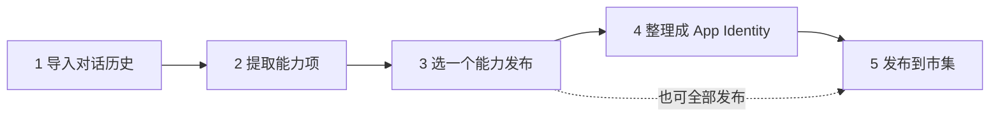
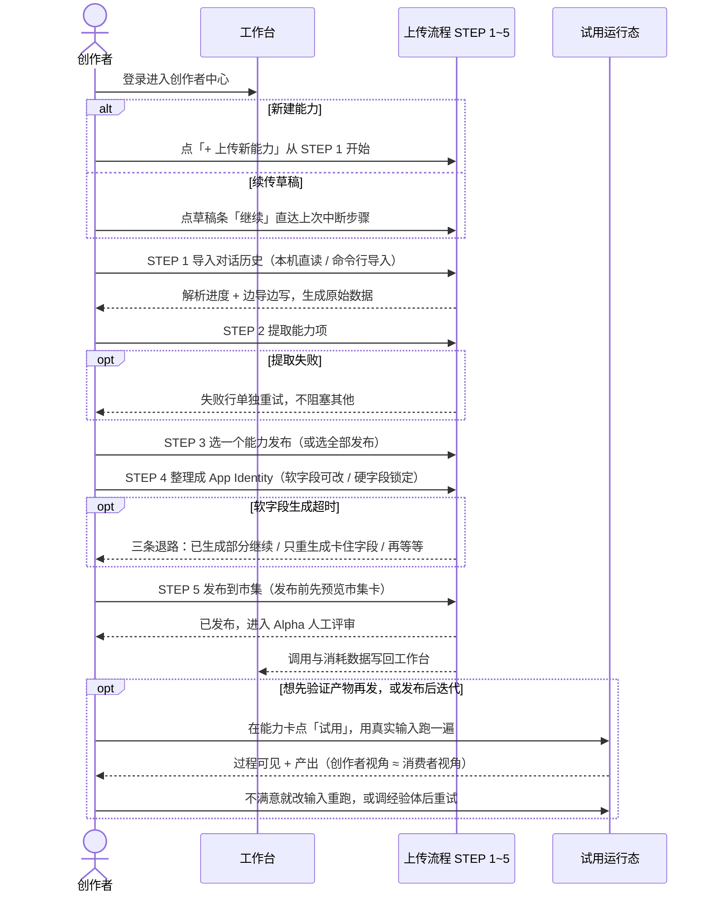

<title>Agora · 创作者中心（Creator Builder）PRD</title>

> 文档定位：本 PRD 描述创作者中心，以 Figma 设计稿《Agora？！》中「能力上传 · Creator Builder」的最新修订链路（设计稿最新修订版，node 1818-24）为准，覆盖创作者中心的核心功能模块与上传主流程。
> 
> 设计稿：[Figma · 能力上传 · Creator Builder](https://www.figma.com/design/XwOk3OdwHGSt6gviqS2Doy/Agora？-！?node-id=233-65)
> 
> 关联文档：[技术方案 · 创作者中心与消费链路](https://enbmphajlu.feishu.cn/docx/GufZdCHVroObq7x6gRDcnK7Sn1d)
> 
> 状态：初稿 · 待评审

# 一、概述

## 1.1 产品背景

Agora 是一个「能力市集」：创作者把自己与 AI 的对话历史提炼成可发布的「能力体」（以 mini-app 形态对外提供服务），消费者在市集与社区中发现并使用这些能力。

创作者中心（Creator Builder）是创作端的核心工作区，承载从「原始对话历史」到「能力体上线」的完整生产链路，包含：工作台、能力管理、五步上传主流程、发布前试用、数据分析与个人主页。

## 1.2 核心设计主张

**创作者 ≈ 消费者（两端几乎一致）。** 创作者在发布前「试用」能力体时看到的运行态，与消费者正式使用时的运行态是同一套界面与状态机，仅相差一个「创作者 / 消费者」视角开关。

## 1.3 目标用户与角色

| 角色 | 说明 | 在本 PRD 中的出现位置 |
|-|-|-|
| 创作者（Creator） | 拥有大量 AI 对话历史、希望把个人经验产品化变现的专业用户（设计稿 persona：Wayne · CGO） | 全部章节 |
| 消费者（Consumer） | 使用能力体的终端用户 | 仅在「试用 · 消费者视角」（第六章）以视角切换形式出现 |

## 1.4 范围

| 本 PRD 覆盖 | 不覆盖（另见对应文档） |
|-|-|
| 创作者中心信息架构与导航外壳 | 消费端社区发现 Feed、市集、能力详情页 |
| 工作台、个人主页（创作者对外名片） | 智能体运行容器的完整技术契约（细节见技术方案） |
| 五步上传主流程（导入、提取、选择、结构化、发布） | 运行界面的组件注册与渲染协议细节（见技术方案） |
| 发布前试用（创作者/消费者双视角）与上线确认 | 计费、分成与收益结算规则 |
| — | 移动端适配、能力网络 Graph 完整图谱页 |

---

# 二、信息架构与导航外壳

创作者中心采用「左侧固定侧栏 + 顶部面包屑栏 + 主内容区」的经典工作台布局。侧栏可收起为纯图标态；外壳在全流程中保持稳定，**五步上传流程中的任何一步都不改变外壳结构**（设计评审批注 D14：不要在每一步里改外壳）。

## 2.1 侧栏导航结构

<table><colgroup><col/><col/><col/></colgroup><thead><tr><th vertical-align="top">分组</th><th vertical-align="top">导航项</th><th vertical-align="top">对应模块</th></tr></thead><tbody><tr><td rowspan="5" vertical-align="top">创作</td><td vertical-align="top">工作台</td><td vertical-align="top">工作台，汇总创作数据与全部能力体（第三章）</td></tr><tr><td vertical-align="top">我的能力</td><td vertical-align="top">已发布/草稿能力体列表管理</td></tr><tr><td vertical-align="top">上传能力</td><td vertical-align="top">五步上传主流程入口（第五章）</td></tr><tr><td vertical-align="top">数据分析</td><td vertical-align="top">调用量、token 消耗等运营数据</td></tr><tr><td vertical-align="top">收益</td><td vertical-align="top">能力体收益与结算</td></tr><tr><td vertical-align="top">我的</td><td vertical-align="top">个人主页</td><td vertical-align="top">对外的创作者名片（第四章）</td></tr></tbody></table>

## 2.2 外壳常驻元素

- 侧栏顶部：Agora 品牌字标 + 收起/展开开关
- 侧栏底部：当前账号常驻区（头像 + 姓名 + 职位，如 Wayne · CGO）
- 顶栏：面包屑导航（如「上传能力 / Creator Builder」）+ 右上角账号头像

---

# 三、工作台

工作台是创作者登录后的默认首页，回答一个问题：「我的能力体经营得怎么样？」页面自上而下分为四个区块，支持「近 7 天 / 近 30 天 / 全部」时间范围切换。

**受众定位：只有创作者自己可见的「经营后台」。** 钱（本月消耗 ¥、收益）、成本（token 趋势）、经营动作（草稿续传、上传入口、能力体管理）只出现在本页；对外展示一律走个人主页（第四章）。两页的功能重叠收敛决策见第四章开头的对照表。

## 3.1 页面结构

| 区块 | 内容 | 示例数据（设计稿） |
|-|-|-|
| 页头摘要 | 标题「创作者中心」+ 一句话经营摘要 | 你发布的 8 个能力体，本月被调用 12,400 次 |
| 核心指标带（4 张大数字卡） | 四张大数字卡分别是已发布能力体数、累计调用次数、本月消耗、活跃消费者数，每张卡都带环比变化 | 8（+2）· 12,400（+18%）· 8.6M tokens（≈¥430）· 310（+12%） |
| 每日 token 消耗趋势 | 折线 + 面积图，标注峰值；可切换「tokens / 调用次数」两个口径 | 峰值 480K |
| 我的能力体列表 | 一张表格，每行依次是名称（含一句话简介）、状态、本月调用、消耗趋势迷你图、收益，以及操作列（试用、编辑、更多）；表格右上角常驻「+ 上传新能力」主按钮 | Persona Generator 4,200 次 ¥180 等 6 条 |
| 草稿与上传中条 | 横向胶囊条展示未完成的上传任务及其所处步骤，点击「去上传流程」可恢复 | Stack Architect · 结构化中 60% / 新批次 · 提取中 3/5 / Magazine Cover · 草稿 |

## 3.2 关键交互

- 「+ 上传新能力」与侧栏「上传能力」等价，均进入五步上传流程（第五章）
- 能力体行内点「试用」，直接进入该能力体的试用运行态（第六章）；点「编辑」进入草稿修改
- 草稿条是断点续传入口：上传流程任何一步中断后，可从工作台一键回到中断步骤（与 5.4 节超时恢复机制呼应）

---

# 四、个人主页（创作者名片）

个人主页是创作者的对外名片，向消费者和其他创作者展示「这个人有什么能力、活跃度如何、作品有哪些」。页面自上而下六个分区：

**受众定位：给别人看的「公开名片」，与工作台（第三章）严格分界。** 本页只展示对外可公开的信任信号——会话密度、知识域、作品，不承载任何经营管理操作。针对评审意见「个人主页与工作台功能有重叠」，两处实际重叠按下表收敛：

| 重叠点 | 工作台（自己看 · 经营口径） | 个人主页（别人看 · 信任口径） | 处理决策 |
|-|-|-|-|
| 调用量指标 | 指标卡「累计调用 12,400」是经营指标，可下钻到趋势与明细 | 指标条「总调用量 12.4k」（设计稿英文 mock：TOTAL INVOCATIONS）是给别人看的信任背书 | 同源同数、两种口径：个人主页上仅作信任背书展示，只读、不可下钻、不带收益等经营维度 |
| 能力列表 | 「能力体列表」按调用量或收益排序，每行带管理操作 | 「能力排行」（设计稿英文 mock：Ability Ranking）按会话密度排序 | 工作台是唯一的管理入口；个人主页的列表只读、按会话密度（即信任背书）排序，不提供任何管理操作 |
| 能力网络图 | 不展示 | 「能力网络」（设计稿英文 mock：Ability Network）缩略分区 | 完整图谱页移出本期范围；个人主页仅保留缩略图分区，不再提供「展开图谱」入口 |

| 分区 | 内容 | 示例数据（设计稿） |
|-|-|-|
| 1. 身份区 | 头像、昵称、身份标签、一句话简介、社交计数（关注 / 粉丝 / 获赞） | Wayne ·「探索型全栈构建者 · System Builder」·「在 AI 与产品之间反复横跳，把会话沉淀成能力。」· 128 following / 2.4k followers / 18.6k likes |
| 2. 指标带 | 一条横向指标带，依次显示能力点数、知识领域数、总调用量、最热主题 | 24 ability points · 6 knowledge domains · 12.4k total invocations · Top topic「Agent 架构」 |
| 3. 能力 · 按会话密度 | 一条条能力排行条，每条显示一根密度条、支撑它的会话段数和趋势箭头，可以逐条下钻；默认只展示前 3 条，点「展开更多」看全部 | 面向大厂 PM 的资格打分器（17 段会话支撑，上升）/ React hydration 调试（12 段，上升）/ 投资人 pitch 复盘（9 段，持平） |
| 4. 会话足迹 · 近半年 | GitHub 风格活跃热力图，体现创作者与 AI 对话的持续活跃度 | — |
| 5. 能力网络 | 以创作者为中心的能力图谱缩略预览（完整图谱页不在本期范围，仅保留此缩略分区） | Agent 架构 / PM 打分器 / React 调试 / Pitch 复盘 / Figma 搭建 / 合规排雷 |
| 6. 作品墙（已发布） | 已发布能力体卡片网格，每张含封面、名称、调用次数 | 已发布 · 8：Persona Generator 4.2k 次调用 等 |

**信任货币。** 能力、会话足迹、能力网络这三个分区合起来证明「这个创作者的能力是真的」：每个能力背后有多少真实会话段数撑着（如「17 段会话支撑」）。

# 五、核心流程：五步上传（主流程）

五步上传是创作者中心的核心生产流程，把创作者本机的对话历史，一步步加工成能在市集上线的能力体。五步之间的关系见下图。

整条流程沿用同一套页面外壳，只替换中间的内容；每一步都能随时存草稿，之后接着做。

## 5.0 全流程通用规则

- **外壳恒定**：五步共用同一外壳——左侧侧栏（激活「上传能力」）、顶栏面包屑「上传能力 / Creator Builder」+「保存草稿」按钮；任何一步都不改变外壳结构（评审批注 D14）
- **步骤条状态语义**：已完成、进行中、待办（显示数字）、异常，五段常驻在内容区顶部。
- **可中断、可恢复**：每步可「保存草稿」退出；工作台草稿条记录所处步骤（如「结构化中 60%」），可断点续传
- **加载态统一策略**：所有耗时步骤都不用转圈，而是用子任务清单、进度短语、边生成边显示来呈现进展，并提供取消或转后台的选项（详见第八章）
- **底栏导航恒定**：左侧是当前步骤摘要（如「第 1 步，共 5 步」），右侧是主按钮「下一步：（动态步骤名）」。

## 5.1 STEP 1 导入对话历史

这一步回答：怎么把创作者散落在本机的 AI 对话历史（Claude / Codex）一次性导入，变成一份可供下一步提取的原始数据。

### 5.1.1 初始空态

首次进入时展示空态引导，大标题「把对话历史，变成可发布的能力」，并排提供两种导入方式：

| 导入方式 | 说明文案（设计稿原文） | 触发动作 |
|-|-|-|
| 一键导入（本机直读）           角标「推荐 · 最全」 | 直接扫描这台机器上全部 \~/.claude、\~/.codex，全自动，无需选文件夹，不会漏。 | 按钮「开始导入」 |
| CURL 命令导入 | 复制一行命令到终端运行，程序化全量扫描你本机全部历史并上传。一个文件夹都不用选。 | 命令框 curl -fsSL agora.app/import \| sh |

**导入说明（页面常驻底部）。** 导入会把你选择的对话历史完整上传到云端，由云端解析、去敏后再用于后续步骤。

### 5.1.2 加载态（导入进行中）

点击「开始导入」后进入加载态，不使用转圈，而是用可感知进展的三层信息：

1. 总进度条 + 量化文案：「68% · 已抓取 146 / 215 段会话 · 5,210 / 8,420 条消息」
2. 子任务清单（依次点亮，让创作者知道进行到哪一步）：连接凭证、拉取会话索引、导入消息并去敏、切分成段落、生成原始数据。
3. 导入清单卡「正在导入的会话…」：逐行展示每个会话的导入状态（03-20 已入 / 05-31 已入 / 04-17 导入中…）

- 支持后台执行：「可在后台继续，完成后通知你」
- 支持取消：底部「取消导入」链接

### 5.1.3 完成态

- 成功横幅：「已导入全部对话历史（Codex + Claude）」、「生成了一份原始数据，下一步从中提取能力项」、「重新导入」链接。
- 原始数据统计 4 格：215 段会话 · 8,420 条消息 · 时间跨度 2026.03-06 · 涉及 14 个项目
- 导入的原始会话（节选）列表：日期 / 标题 / 条数，卡片右上角标注「只读」
- 底栏：「原始数据仅你可见 · 第 1 步，共 5 步」+ 主按钮「下一步：提取能力项」

## 5.2 STEP 2 从原始数据提取能力项

这一步回答：AI 扫描原始数据后，识别出哪些「反复出现、值得打包成 mini-app 的能力」，并让创作者批量勾选。设计稿对原版的增强点：批量勾选 + 频次条 + 失败可重试。

### 5.2.1 加载态（提取进行中）

- 标题「正在从原始数据提取能力项…」，说明文案点明策略：「识别到的能力会逐个浮现」
- 子任务清单（依次点亮）：分析会话段落、聚类相似工作流、形成候选能力、评估频率与可打包度、按成功率排序。
- 逐个浮现：识别出一个能力就先显示一个，不用等全部跑完（计数「已浮现 3 / 9 能力项…」）；已识别的立即以卡片出现（带「刚浮现」角标），未识别的显示占位骨架卡。

### 5.2.2 结果态（批量选择）

结果横幅：「已分析 215 段原始数据，识别出 9 个能力项，按出现频率与可打包度排序，下面是前 6 个。」每个能力项一行，构成如下：

- 每行依次是：勾选框、能力名称、置信徽章（高 / 中 / 低）、类型标签（核心工作流 / 经常出现 / 偶尔出现）、一句话描述，最右边是频次条（如「18 段」，表示支撑这个能力的会话段数）。
- 页面底部还有一行置信分布摘要：高 4 个、中 3 个、低 2 个。

| 能力项（设计稿示例） | 置信 | 类型 | 描述 | 频次 |
|-|-|-|-|-|
| 需求炼金师 | 高 | 核心工作流 | 把一段杂乱想法炼成结构化 PRD | 18 段 |
| VC 拷打模拟器 | 高 | 经常出现 | 用一线投资人视角逐题拷打 pitch | 9 段 |
| Verifiable 核查报告 | 高 | 核心工作流 | 给产品、公司、代码仓库、补剂做先核查再判断的尽调 | 16 段 |
| HK 资格打分器 | 中 | 偶尔出现 | 按优才/高才 A-B-C 给画像打分 | 7 段 |
| 每日 AI 产品雷达 | 中 | 经常出现 | 24h 自动整理竞品动态成表 | 24 段 |
| Spec 缺口审查官 | 中 | 经常出现 | 逐行红线审方案，揪 P0 | 12 段 |

### 5.2.3 失败可重试

单个能力项提取失败不阻塞整体：失败行显示错误标记、名称和错误副文（如「港险资格打分器 · 上游解析中断 · 段 5/9」），并带一个行内「重试」链接，其余能力项正常可选。

底栏：「识别 9 个 · 展示前 6 · 第 2 步，共 5 步」+ 主按钮「下一步：批量处理已选 3 项」（按钮文案随勾选数动态变化）。

## 5.3 STEP 3 选一个能力发布

这一步要做的事：从上一步提取出的能力里，挑一个真正想发布的，进入下一步把它整理清楚；也可以一个都不挑，直接把识别出来的能力全部发布。

### 5.3.1 页面构成

页面顶部是一个醒目的整体选项「全部发布（不逐个选）」。点它，就把这一批识别出来的能力（设计稿示例是 4 个）一次性自动整理、批量发布，跳过逐个展开的过程，适合不想一个个调的创作者。

下面是「或逐个选定」的能力单选列表。每一行只放最必要的信息，方便快速判断该发哪一个：

- 能力名称，例如「面向大厂 PM 的资格打分器」
- 一句话类型，例如打分器、PRD 工具、核查、陪练
- 支撑它的会话段数，例如「17 段」。段数越多，说明这个能力在真实对话里出现得越频繁
- 置信度，例如「置信 86%」，表示系统对「它适合打包成能力」的把握有多大

选中其中一个后，底部主按钮会跟着变成「下一步：结构化『面向大厂 PM 的资格打分器』」，明确告诉创作者下一步要整理的是哪一个。

这一步是纯粹的选择，结果即时呈现，没有等待，也没有加载态。

## 5.4 STEP 4 把能力整理成 App Identity

这一步要做的事：把选定的能力，整理成一份能直接拿去发布的「能力说明书」。设计稿把这份说明书叫作 App Identity（也就是技术方案里说的 manifest）。

App Identity 分成性质完全不同的两部分，页面上一眼就能区分：

- **软（经验体生成，可改 / 可重生成）**：这部分由 AI 读着创作者的经验体自动写出来，创作者觉得不合适可以随时改，也可以让它重新生成。它决定这个能力「长什么样、怎么说话」。
- **硬（平台固定契约，锁定）**：这部分由平台定，发布前不随生成变动，锁起来不让改。它决定这个能力「接什么输入、出什么产物、守什么底线」，是平台和消费端都要依赖的稳定约定。

左侧可以在这一批能力之间来回切换，右侧就显示当前这个能力的 App Identity。

### 5.4.1 软：经验体生成的部分（可改 / 可重生成）

| 字段 | 含义 | 设计稿示例 |
|-|-|-|
| name | 对外显示的名称 | 面向大厂产品经理的资格打分器 |
| tagline | 一句话卖点 | 按大厂标准给资格做 A-C 档判断，并指出缺口 |
| role | 它扮演的角色 | 资深大厂面试官 |
| goal | 它要达成的目标 | 按 A-C 档判断，并指出关键缺口 |
| instructions | 它的工作步骤 | 读材料，按守则逐个维度评估，给出档位与缺口 |
| skill_set | 它的拿手本事 | 拆解维度、定位证据、给出分档结论 |
| starter_prompts | 给消费者的起手示例 | 「帮我评这份简历能不能进大厂 P7」 |

### 5.4.2 硬：平台固定契约的部分（锁定）

| 字段 | 含义 | 设计稿示例 |
|-|-|-|
| id | 能力的唯一标识，创建后不再改变 | pm-resume-scorer |
| version | 版本号 | 0.1.0 |
| status | 当前状态，此时还是草稿 | draft |
| inputs · schema | 运行时要消费者填写什么 | 受众（选项）、目标岗位（必填）、简历（必填）、参考 JD（文件） |
| output · type | 它产出什么形态的产物 | scorecard 评分卡 |
| boundaries | 风险等级与红线 | 风险低；红线是不编造经历 |

### 5.4.3 生成过程与兜底

软的部分是 AI 现场生成的，所以会有一个生成过程：字段一个个出现、数组项一条条补齐，已经好的直接显示终值，正在生成的显示骨架条。

如果某个字段生成得比平时久，界面不让创作者干等，而是给三条退路：用已经生成好的部分先继续、只重新生成卡住的那个字段、或者再等一会儿（后台继续跑）。已经生成好的内容不会因为重试而丢失。

兜底规则：如果同一处重试两次仍然失败，就落到一个说人话的错误态（重试 / 改输入 / 转人工），不会一直转圈，也不会把错误码直接甩给创作者。

## 5.5 STEP 5 发布到市集

> 提示：发布这一步的设计还在调整中。本节描述的是当前修订稿（node 1818-24 修订版）呈现的样子，细节后续可能还会变。

这一步要做的事：把整理好的能力正式发布到市集，并让创作者在发布前就看到它在市集里长什么样。

页面分成左、中、右三块。左侧是能力切换列表，和上一步一样，可以在这一批能力之间切换。中间是一张市集卡预览，也就是消费者将来在市集里看到的样子：上面有封面图标、类型标签、名称、一句话卖点、能力简介、创作者署名、「源自一次真实会话」的可信标记，以及价格和一个「试用」按钮。右侧说明这张卡的每个位置分别从哪来，见下表。

| 卡片上的位置 | 内容从哪来 |
|-|-|
| 名称、一句话卖点 | 来自上一步 App Identity 的软字段，发布前可改 |
| 封面图标、价格 | 由创作者在发布前自己设定 |
| 创作者署名 | 自动取创作者账号 |
| 装机量、评分 | 上线后由真实使用数据填充 |
| 试用按钮 | 系统固定，所有能力卡都有 |

封面图标有三种来源可选：根据产物类型自动生成的字形图标、创作者用 AI 生成或自己上传的图片、或者用 HTML 渲染的一张产物快照。

发布后，能力会进入 Alpha 人工评审；上线后可以在工作台看到它的调用量与消耗。

---

# 六、试用与发布上线（进行中）

> 本章进行中：试用与发布上线的能力仍在设计中、尚未定稿。下面只做最简说明，细节等定稿后再展开补充。

试用，是创作者在正式投入前用真实输入把能力跑一遍、确认产物的方式，入口在能力卡或「我的能力」里的「试用」。它和发布是解耦的——可以先试用、满意了再发布，也可以先发布、之后再回来迭代。

试用运行态的核心原则是「创作者 ≈ 消费者」：创作者试用时看到的运行界面，和消费者将来正式使用时几乎完全一样，只差一个「创作者 / 消费者」视角开关。运行过程大致分三步：先填一份简单的输入表单（Intake），然后是过程可见、不转圈的运行中，最后是产出态（产物卡，可继续对话微调）。试用满意后可发起发布上线。

---

# 七、用户操作路径（端到端时序图）

本章把第三\~六章的页面级描述串成一条用户视角的端到端操作时序，标出每一个可选分支：哪里可以进、哪里可以退、哪里可以绕。实线为用户主动操作，虚线为系统反馈。

## 7.1 可选操作路径速查

| 分支点 | 所在位置 | 用户可选路径 | 去向与规则 |
|-|-|-|-|
| 上传入口 | 工作台 | 一是点「+ 上传新能力」新建；二是点草稿条「继续」续传 | 新建从 STEP 1 空态开始；续传直达上次中断的步骤，已完成的步骤可回看 |
| 导入方式 | STEP 1 | 一是本机直读（主推，全量导入）；二是命令行一键导入 | 两者都进入同一套解析加载态，最后生成一份原始数据 |
| 提取失败 | STEP 2 加载态 | 在失败的那一行单独点「重试」 | 只重新提取这一项，不影响其他；错误用人话描述，不会裸露错误码 |
| 选择范围 | STEP 3 | 一是选定一个能力，进下一步逐个整理；二是直接点「全部发布」 | 选一个就进 STEP 4 整理选中的那个；全部发布则跳过逐个展开，自动整理并批量发布 |
| 软字段生成超时 | STEP 4 | 一是用已生成的部分继续；二是只重新生成卡住的字段；三是再等等（后台继续跑） | 用已生成部分继续会带着已完成的字段进 STEP 5；后两者留在 STEP 4。同一处重试两次仍失败，落错误态（重试 / 改输入 / 转人工） |
| 发布与评审 | STEP 5 | 发布前先看市集卡预览，确认无误后发布到市集 | 发布后进入 Alpha 人工评审；上线后在工作台看调用与消耗 |
| 试用 | 能力卡 / 我的能力 | 一是满意就直接发布；二是改输入重跑；三是调经验体（品味 / 守则 / 案例）后重新试用 | 试用不是发布的强制前置，可以先试再发、也可以先发后迭代；重跑不限次数 |

全链路异常兜底（永不裸转圈、绝不裸露错误码、每个等待都有退路）的完整原则与状态机验收清单见第八章。

# 八、状态与异常处理汇总

设计稿为每个耗时环节都画了加载/异常态，并贯彻统一原则。开发时应将下表作为状态机验收清单：

**三条全局原则。** 一是永远不停在转圈——一律用子任务清单、进度短语、边生成边显示来表达进展；二是绝不裸露错误码——错误必须落到带出路的错误态（重试 / 改输入 / 转人工）；三是已生成的内容不会丢——中断、超时、失败都保留已完成部分。

| 环节 | 加载态呈现 | 异常与退路 |
|-|-|-|
| 1. 导入 | 总进度条 + 量化文案（如 68%、已抓取 146 / 215 段）+ 五项子任务清单 + 导入清单卡 | 可随时取消；也可转后台继续，完成后通知 |
| 2. 提取 | 子任务清单 + 能力逐个浮现（如已浮现 3 / 9）+ 骨架卡 | 单项失败不阻塞整体：失败行显示错误副文 + 行内重试 |
| 3. 选择 | 纯选择，结果即时呈现，没有加载态 | — |
| 4. 结构化（App Identity） | 软字段逐项浮现、数组项逐条补齐（如正在补全字段 4 / 6）；硬字段直接锁定显示 | 软字段生成超时给三条退路：用已生成部分继续 / 只重生成卡住字段 / 再等等；同一处重试两次仍失败则落错误态 |
| 5. 发布 | 发布前展示市集卡预览，让创作者确认对外呈现 | 发布后进入 Alpha 人工评审；上线后在工作台看调用与消耗 |
| 试用运行 | 进度清单（读取经验体、聚类、校验引用、排版）+ 骨架画像卡 | 随时「重置试用」重来；也可改输入重跑 |
| 全流程 | — | 随时「保存草稿」退出；工作台草稿条支持断点续传 |